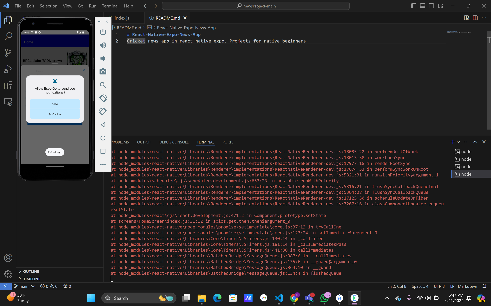
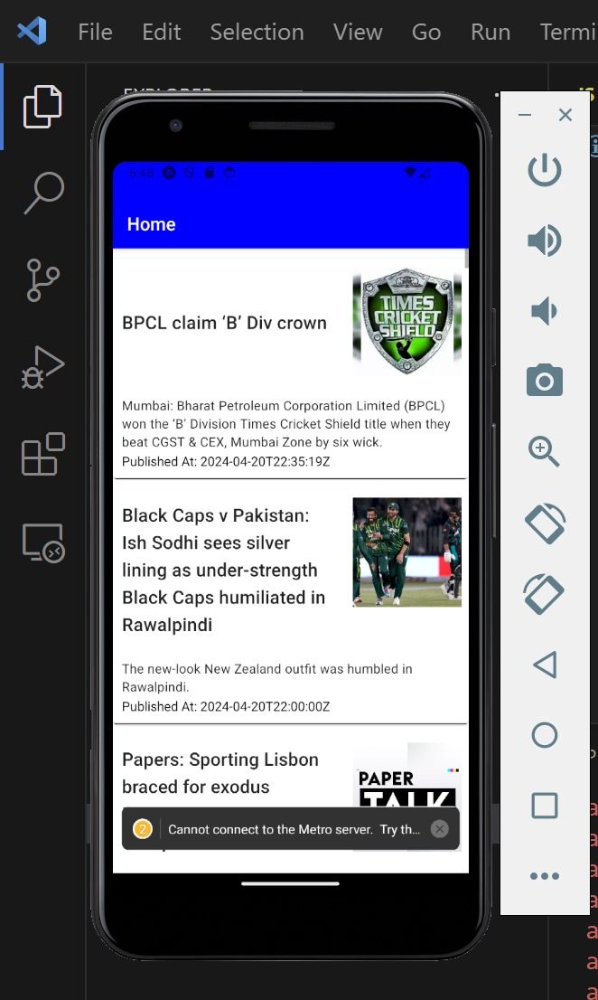
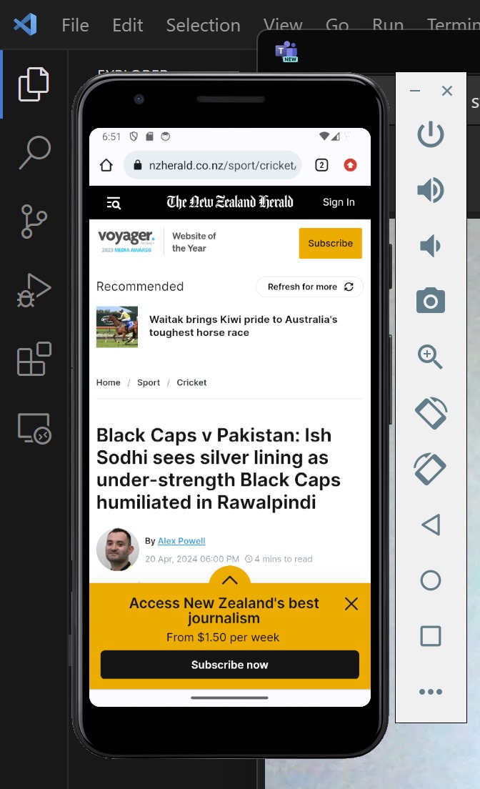
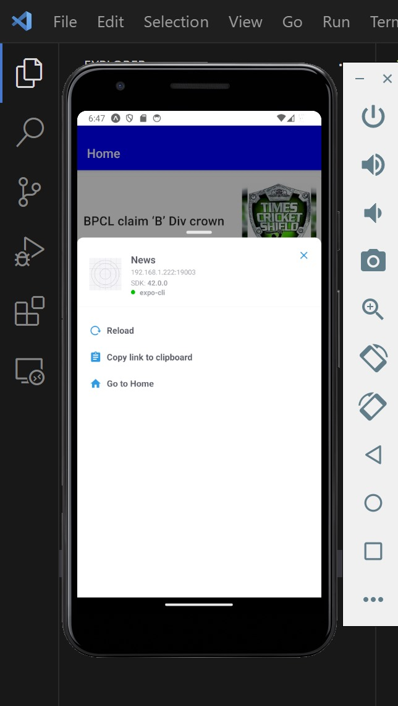

# Tech for Mobile Apps
# React-Native-Expo-News-App
Cricket news app in react native expo. Projects for native beginners
## Students
### Name: Shivani Kormi
### Mail: korimisi@mail.uc.edu
### Name: RajKumar Telukuntla
### Mail: telukurr@mail.uc.edu
### Name: Sai Geethika Akkineni
### Mail: akkinesa@mail.uc.edu

# Personal Mobile App Project Final
Given below is the bare minimum code for a React Native app, which is the essence of what this code is all about.Let's break it down:

##Import Statements

- React: The one runs it over React library which is required to make React components.

- StyleSheet, Text, View: These are the elements rendered and processed through code while the management and styles are executed by react Native.

##App Component
- We begin the App component as a functional component with the arrow function expression syntax.
- Within the App component, as a single View component is displayed, which is the basis for the element of other components.
- The View component is already declared with a style attribute, which is set up using styles.container, which simply defines background color of the container.

##StyleSheet
- With the StyleSheet.create() method, you define styles, using which the individual component can be given different appearances. Here, it introduces a style object called styles with a property of container which includes the value of the background color of the container.

##HomeScreen Component:
- The HomeScreen component is imported from HomeScreen.js file and is positioned inside View component. This means that there is an android.support.v17.gridsample architecture referenced in the screens directory of the project.
Often, this code is primarily responsible for the app entrance (App component) point, as well as rendering the HomeScreen component inside it. The styles const}-{ the styling of the main container.

This is the code that will represent a React Native component (HomeScreen) that fetches news articles related for the NewsAPI and displays them in a scrollable list.
And the below are some of the other components we have included in the code used for the application 
## Imports
   - React, Component, View, Text, Image, ScrollView, and Linking are imported from the react-native package.
   - Axios is imported to make HTTP requests.
   - Card, Title, and Paragraph are imported from the react-native-paper package.
   - Header is imported from a custom component file (../../components/AppBar).

## Class Component
   - The HomeScreen class extends Component, indicating that it's a class-based component.
   - Inside the component, the initial state is defined with properties for storing fetched articles, loading state, and errors.

## getArticles Function
   - getArticles function is defined to make an HTTP GET request to the NewsAPI endpoint.
   - Axios is used to perform the request.
   - If the request is successful, the response data (an array of articles) is mapped to a new array containing only the required properties (date, title, url, description, urlToImage).
   - The mapped array is then used to update the component state with the fetched articles.
   - If an error occurs during the request, the error is stored in the component state.

## Component Lifecycle Method - componentDidMount
   - The componentDidMount method is called automatically after the component is mounted (rendered for the first time).
   - In this method, the getArticles function is called to fetch articles from the API.
## Render Method
   - In the render method, the state variables isLoading and articles are destructured from this.state.
   - If isLoading is true, a loading message is displayed.
   - If isLoading is false, the fetched articles are mapped to individual Card components.
   - Each Card displays the article's title, image (if available), description, and published date.
   - The Card components are wrapped inside a ScrollView for scrollability.

Overall, this component fetches news articles from an API, displays them as cards with relevant information, and handles loading and error states accordingly.

